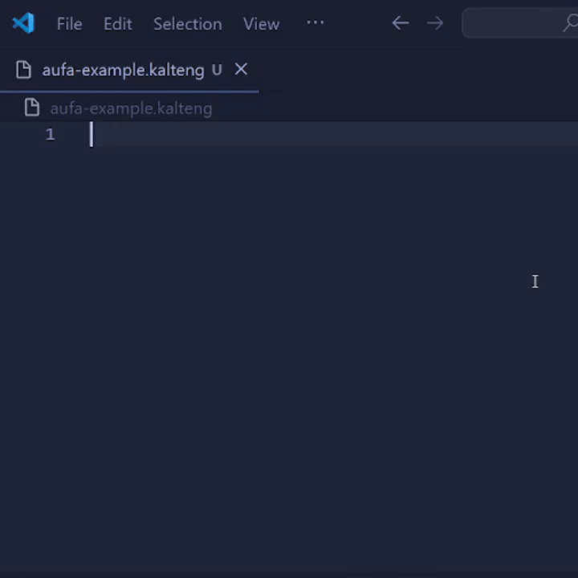

# kalteng-language-support for Visual Studio Code

Visual Studio Code extension for supporting [kalteng-language](https://github.com/Aufaruq/kalteng-language) coding experience.

## Features

- Syntax Highlight ✅
- Code Formatter ✅
- Code Snippet ✅

## Code Snippet

- Loop: `ulihbalik`
- Decision: `amun`
- Function declaration: `jadigasan`
- Asynchronous function declaration: `kepikiran`
- Error handling: `salahway`

## Preview

